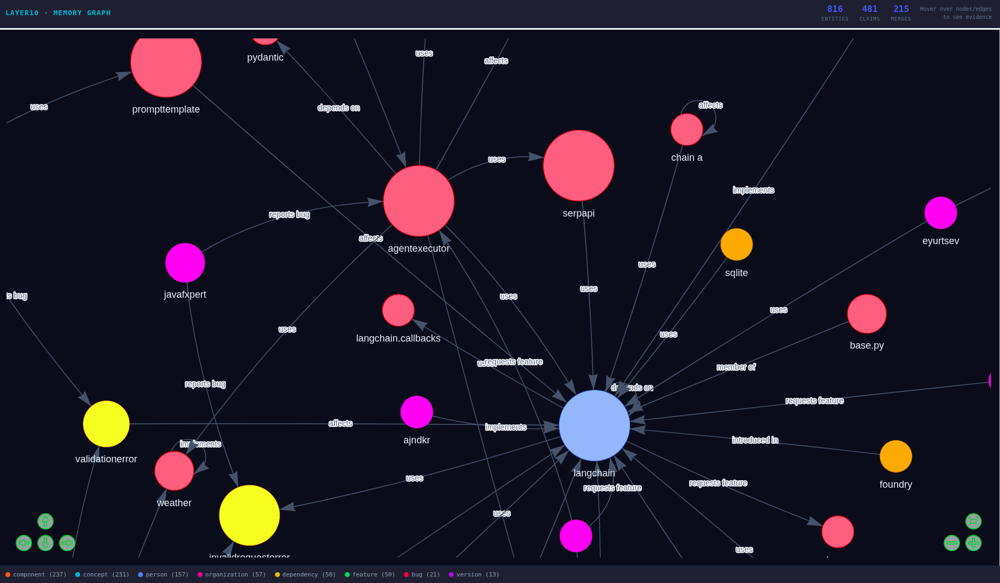
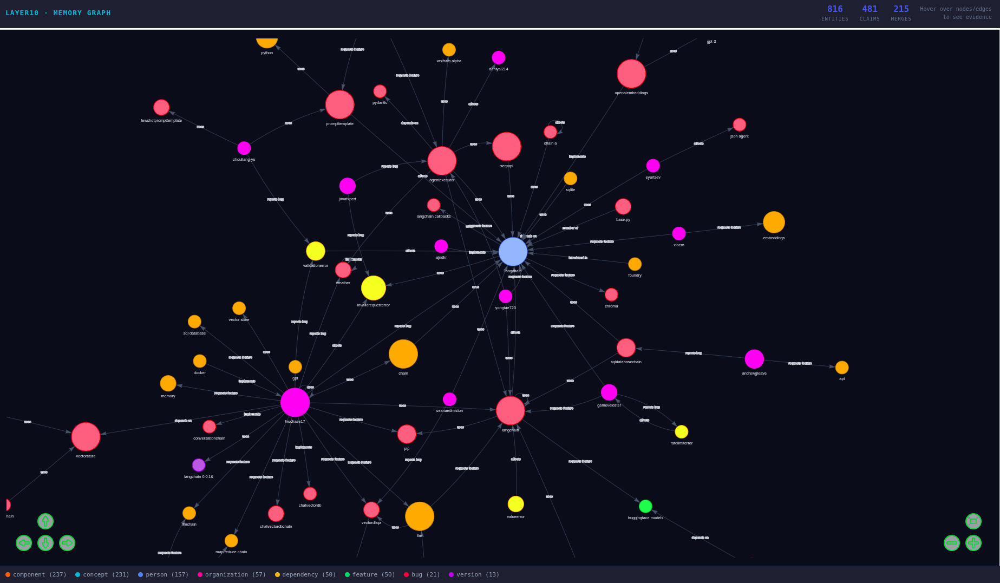
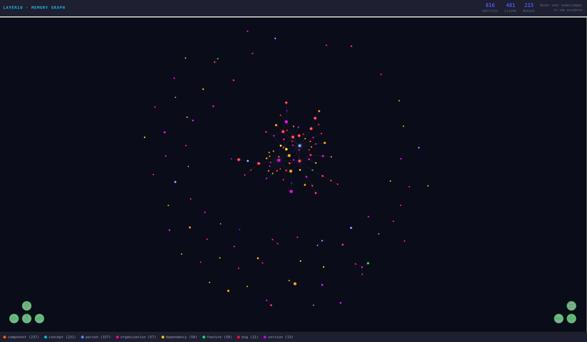

# Layer10 Take-Home: Grounded Long-Term Memory Graph

> Structured extraction, deduplication, and a queryable memory graph built from LangChain GitHub Issues and Comments.

---

## Table of Contents

1. [Project Overview](#1-project-overview)
2. [Repository Structure](#2-repository-structure)
3. [Corpus](#3-corpus)
4. [Quick Start](#4-quick-start)
5. [Pipeline — Step by Step](#5-pipeline--step-by-step)
6. [Ontology and Schema](#6-ontology-and-schema)
7. [Extraction Contract](#7-extraction-contract)
8. [Deduplication and Canonicalization](#8-deduplication-and-canonicalization)
9. [Memory Graph Design](#9-memory-graph-design)
10. [Retrieval and Grounding](#10-retrieval-and-grounding)
11. [Visualization](#11-visualization)
12. [Outputs](#12-outputs)
13. [Layer10 Adaptation](#13-layer10-adaptation)
14. [Tradeoffs and Known Limitations](#14-tradeoffs-and-known-limitations)

---

## 1. Project Overview

This system turns LangChain GitHub Issues and comments into a **grounded long-term memory graph** — a queryable store of typed entities and claims where every fact traces back to a verbatim excerpt from a source artifact, with author, timestamp, and character offsets.

The core design principle is **evidence-first**: nothing enters the memory graph without a pointer to the source text that supports it. This makes the system auditable, correctable, and safe to use for downstream reasoning.

```
GitHub Issues + Comments
         │
         ▼
   artifacts.json        unified, immutable source representation
         │
         ▼
    chunks.json          filtered (low-signal removed), chunked for LLM
         │
         ▼
   extractor.py          LLM → typed entities + claims + evidence envelopes
         │
         ▼
 deduplication.py        exact + fuzzy entity merge, claim dedup, merge log
         │
         ▼
     graph.py            SQLite memory graph with FTS indices
         │
         ▼
   retrieval.py          keyword + FTS + neighbour expansion → context packs
         │
         ▼
visualization.py         NetworkX + pyvis → interactive offline HTML
```

---

## 2. Repository Structure

```
layer10/
├── data/
│   ├── raw/
│   │   ├── issues.json                   # raw GitHub issues via GraphQL API
│   │   └── comments.json                 # raw GitHub comments
│   └── processed/
│       ├── artifacts.json                # unified artifact layer
│       ├── chunks.json                   # filtered + chunked artifacts
│       ├── extracted_entities.jsonl      # raw LLM extraction (append-only)
│       ├── extracted_claims.jsonl        # raw LLM extraction (append-only)
│       ├── quarantine.jsonl              # low-confidence / failed chunks
│       ├── checkpoint.txt                # extractor resume state
│       ├── extraction_stats.json         # run metrics
│       ├── canonical_entities.json       # post-dedup entities
│       ├── canonical_claims.json         # post-dedup claims
│       ├── merge_log.json                # full audit trail of all merges
│       ├── memory.db                     # SQLite memory graph
│       ├── context_packs.json            # example retrieval outputs
│       └── viz/
│           └── index.html                # self-contained interactive graph
├── src/
│   ├── data_collection.py                # fetch issues + comments via GitHub API
│   ├── parse_artifacts.py                # convert raw → unified artifacts
│   ├── prepare_chunks.py                 # filter low-signal, chunk long artifacts
│   ├── extractor.py                      # LLM extraction pipeline
│   ├── patch_issue_numbers.py            # backfill issue_number into evidence
│   ├── deduplication.py                  # entity + claim deduplication
│   ├── graph.py                          # build SQLite memory graph
│   ├── retrieval.py                      # grounded retrieval
│   └── visualization.py                  # interactive graph visualization
├── utils/
│   └── pretty_json.py                    # JSON formatting utility
├── requirements.txt
└── README.md
```

---

## 3. Corpus

**Source:** LangChain GitHub repository (`hwchase17/langchain`)  
**Collection method:** GitHub GraphQL API  
**Data collected:**
- `issues.json` — issue id, number, title, body, state, author, created_at
- `comments.json` — comment id, issue_id, body, author, created_at

**Scale:**
- ~48,445 chunks generated from artifacts
- 100 chunks processed in test run (rate-limited free-tier LLM)
- 1,112 raw entities → 647 canonical entities
- 402 raw claims → 395 canonical claims

**To reproduce the download:** Set `GITHUB_TOKEN` in your `.env` file and run:

```bash
python src/data_collection.py
```

---

## 4. Quick Start

### Prerequisites

```bash
pip install -r requirements.txt
```

### Environment

```bash
cp .env.example .env
# Set GITHUB_TOKEN for data collection
# Set GEMINI_API_KEY for extraction (free at https://aistudio.google.com)
```

### Run the full pipeline

```bash
python src/data_collection.py       # fetch raw data
python src/parse_artifacts.py       # build artifact layer
python src/prepare_chunks.py        # filter + chunk
python src/extractor.py             # LLM extraction (set MAX_CHUNKS at top of file)
python src/patch_issue_numbers.py   # backfill issue numbers
python src/deduplication.py         # canonicalize
python src/graph.py                 # build memory graph
python src/retrieval.py             # run example queries
python src/visualization.py         # generate interactive UI
```

### Open the visualization

```bash
xdg-open data/processed/viz/index.html   # Linux
open data/processed/viz/index.html        # macOS
```

---

## 5. Pipeline — Step by Step

### Step 1 — Artifact Layer (`parse_artifacts.py`)

Issues and comments are converted into a unified `Artifact` schema:

```json
{
  "artifact_id":    "I_kwDOIPDwls5VYaxF",
  "artifact_type":  "issue",
  "issue_number":   142,
  "issue_title":    "Add streaming support to OpenAI LLM",
  "issue_state":    "CLOSED",
  "author":         "hwchase17",
  "timestamp":      "2022-11-14T10:22:31Z",
  "text":           "..."
}
```

Artifacts are **immutable** — they are never modified after creation. All downstream processing reads from this layer.

### Step 2 — Chunking (`prepare_chunks.py`)

- **Low-signal filtering:** artifacts shorter than 20 characters or matching patterns like `+1`, `lgtm`, `thanks` are removed
- **Chunking:** artifacts longer than 400 words are split with 50-word overlap, preserving context across chunk boundaries
- Result: **48,445 chunks** with metadata (chunk_id, artifact_id, issue_title, issue_state, author, timestamp)

### Step 3 — Extraction (`extractor.py`)

Each chunk is sent to an LLM with a structured prompt. The model returns entities and claims as JSON. See [Section 7](#7-extraction-contract) for full details.

Key properties:
- **Checkpointed** — safe to interrupt and resume; `checkpoint.txt` tracks completed chunks
- **Progress saved after every chunk** — `extraction_stats.json` is updated continuously
- **Repair pass** — if JSON parsing fails, a second LLM call attempts to fix the malformed output
- **Quality gate** — `confidence=low` items go to `quarantine.jsonl`, not the main output

### Step 4 — Deduplication (`deduplication.py`)

See [Section 8](#8-deduplication-and-canonicalization) for full details.

### Step 5 — Memory Graph (`graph.py`)

Builds `memory.db` from canonical entities and claims. See [Section 9](#9-memory-graph-design).

### Step 6 — Retrieval (`retrieval.py`)

See [Section 10](#10-retrieval-and-grounding).

### Step 7 — Visualization (`visualization.py`)

See [Section 11](#11-visualization).

---

## 6. Ontology and Schema

### Entity Types

| Type | Description | Example |
|---|---|---|
| `person` | GitHub user acting as author, reporter, or commenter | `hwchase17` |
| `component` | Named module, class, function, or subsystem | `BaseChatModel`, `LLMChain` |
| `bug` | A described defect or unintended behaviour | `streaming callback not fired` |
| `feature` | A named capability or enhancement | `async streaming support` |
| `version` | Semver string or release name | `0.0.139`, `v0.2` |
| `dependency` | External package | `openai`, `tiktoken`, `faiss-cpu` |
| `concept` | Architectural pattern or design term | `memory persistence`, `tool calling` |
| `organization` | Company, team, or project | `LangChain`, `Anthropic` |

### Claim Types

**Relational:**
- `reports_bug`, `fixes_bug`, `implements`, `requests_feature`
- `uses`, `depends_on`, `affects`, `introduced_in`, `fixed_in`, `member_of`

**Lifecycle:**
- `state_change` — issue moved from open → closed, or a decision reversed
- `assigned_to` — ownership established
- `duplicate_of` — deduplication signal embedded in knowledge

**Factual:**
- `has_property` — attribute-value facts
- `decision_made` — a design decision recorded in discussion
- `workaround_exists` — a workaround documented

### Evidence Envelope

Every entity and claim carries a mandatory `evidence` array. Each evidence object:

```json
{
  "chunk_id":     "I_kwDOIPDwls5VYaxF_0",
  "artifact_id":  "I_kwDOIPDwls5VYaxF",
  "excerpt":      "The callback is never called when streaming=True",
  "char_start":   142,
  "char_end":     192,
  "author":       "hwchase17",
  "timestamp":    "2022-11-14T10:22:31Z",
  "issue_number": 142
}
```

`char_start`/`char_end` provide byte-exact provenance back to the source artifact.

---

## 7. Extraction Contract

### Prompt Design

The extraction prompt gives the LLM:
- A full JSON schema with allowed values for every field
- Explicit rules: excerpts must be verbatim substrings of the chunk text
- Negative examples: what not to do (invent entities, self-referential claims, etc.)
- Hard limits: max 8 entities and 10 claims per chunk

### Validation and Repair

1. **JSON parsing** — strips markdown fences, attempts `json.loads`
2. **Fallback extraction** — if parsing fails, uses regex to find the first `{...}` block
3. **LLM repair pass** — if still invalid, sends the bad output to a repair prompt
4. **Schema validation** — `entity_type` and `claim_type` checked against enums; unknown values dropped
5. **Excerpt grounding** — every excerpt checked as a case-insensitive substring of chunk text; ungrounded excerpts fall back to the entity name as minimal evidence
6. **Quality gate** — `confidence=low` items written to `quarantine.jsonl`, not main output

### Versioning

Every extracted record is tagged with `extraction_version: "v1.0.0"`. When the prompt or schema changes:
1. Bump the version string at the top of `extractor.py`
2. Delete `checkpoint.txt` to reprocess all chunks, or delete only specific chunk_ids to backfill selectively
3. Re-run `deduplication.py` → `graph.py` — idempotent upserts handle overlapping records safely

### Stats from test run (100 chunks)

| Metric | Value |
|---|---|
| Chunks processed | 100 |
| Raw entities extracted | 1,112 |
| Raw claims extracted | 402 |
| Canonical entities (post-dedup) | 647 |
| Canonical claims (post-dedup) | 395 |
| Entity merges | 175 |
| Claim merges | 6 |

---

## 8. Deduplication and Canonicalization

### Artifact Deduplication

Handled upstream in `prepare_chunks.py`:
- Low-signal artifacts filtered by length and pattern matching
- Each artifact has a stable `artifact_id` (GitHub node ID), so re-ingesting the same artifact is naturally idempotent

### Entity Canonicalization — Two Passes

**Pass 1 — Exact merge:** All entities normalized (`lowercase + strip + collapse whitespace`) and grouped by `(entity_type, canonical_name)`. Multiple extractions of the same entity from different chunks are merged, with all evidence pointers accumulated.

**Pass 2 — Fuzzy merge:** Within each entity type bucket, records whose name sets (canonical + aliases) overlap above a `SequenceMatcher` similarity threshold of **0.85** are merged via union-find. This catches:
- `BaseChatModel` vs `base_chat_model` vs `base chat model`
- `langchain` vs `LangChain` vs `langchain (component)`
- Minor typos and capitalisation differences

The canonical record is chosen as the one with the most evidence (highest source support). All other names become aliases.

### Claim Deduplication

Claims grouped by `(claim_type, canonical_subject_id, canonical_object_id)` — after remapping entity IDs to their post-merge canonical versions. Duplicate claims are merged into one record with:
- All evidence pointers accumulated
- The longest (most descriptive) `predicate_text` kept
- Validity window widened to `min(valid_from)` → `max(valid_until)`

### Merge Safety and Reversibility

Every merge is recorded in `merge_log.json`:

```json
{
  "merge_type": "fuzzy",
  "canonical_id": "ent_a1b2c3d4e5f6g7h8",
  "canonical_name": "langchain",
  "merged_ids": ["ent_x1y2...", "ent_p9q8..."],
  "similarity_threshold": 0.85,
  "merged_at": "2026-03-08T23:24:30Z"
}
```

To undo a merge: look up `merged_ids` in the original `extracted_entities.jsonl` (append-only, never modified), restore as separate records, and rebuild the graph. The JSONL files are the source of truth.

### Conflicts and Revisions

Claims have `valid_from`, `valid_until`, and `is_current` fields. When a newer chunk provides evidence that a claim is no longer true, `valid_until` is set and `is_current` becomes `False`. The retrieval layer returns `is_current=True` claims by default; historical claims are still queryable.

---

## 9. Memory Graph Design

### Storage: SQLite with FTS5

**Why SQLite:** Zero infrastructure, single portable file, full SQL for graph traversal via JOIN, FTS5 for full-text search with BM25 ranking. Maps directly to Postgres + pgvector for production scale.

### Schema

```sql
entities(
  entity_id TEXT PK, entity_type TEXT, canonical_name TEXT,
  description TEXT, confidence TEXT, aliases JSON, evidence JSON,
  extraction_version TEXT, extracted_at TEXT, updated_at TEXT
)

claims(
  claim_id TEXT PK, claim_type TEXT,
  subject_id TEXT FK→entities, object_id TEXT FK→entities,
  predicate_text TEXT, valid_from TEXT, valid_until TEXT,
  is_current INTEGER, confidence TEXT, evidence JSON,
  extraction_version TEXT, extracted_at TEXT, updated_at TEXT
)

entity_aliases(alias TEXT, entity_id TEXT)   -- fast alias lookup
merge_log(id, merge_type, canonical_id, merged_ids JSON, merged_at, note)

-- Full-text search
entities_fts  USING fts5(canonical_name, description, aliases)
claims_fts    USING fts5(predicate_text)
```

### Graph Stats (test run)

| Entity Type | Count |
|---|---|
| component | 198 |
| concept | 157 |
| person | 119 |
| organization | 51 |
| feature | 46 |
| dependency | 45 |
| bug | 20 |
| version | 11 |
| **Total** | **647** |

| Claim Type | Count |
|---|---|
| uses | 148 |
| requests_feature | 90 |
| reports_bug | 49 |
| affects | 44 |
| implements | 23 |
| depends_on | 17 |
| has_property | 10 |
| fixes_bug | 8 |
| member_of | 5 |
| assigned_to | 1 |
| **Total** | **395** |

### Idempotency

All inserts use `ON CONFLICT ... DO UPDATE`. Running the graph build twice produces identical results. Re-processing a subset of chunks updates only affected records.

### Permissions (Conceptual)

Each `evidence` object carries `artifact_id`. In a multi-tenant deployment:
1. At query time, resolve which `artifact_id` values the requesting user can access
2. Filter returned evidence to accessible artifacts only
3. If a claim's entire evidence set is inaccessible, suppress the claim
4. Redacted artifacts null out their evidence pointers; claim structure is retained for audit

---

## 10. Retrieval and Grounding

### Strategy

```
question
    → keyword extraction (stopword removal)
    → FTS search over entities_fts + claims_fts
    → alias lookup (each keyword checked against entity_aliases table)
    → neighbour expansion (direct claims for each matched entity)
    → rank by: confidence tier → evidence count
    → diversity pruning (max 3 claims per entity)
    → conflict detection
    → citation formatting
    → ContextPack
```

### Citation Format

Every returned item includes formatted citations:

```
[hwchase17, issue #142, 2022-11-14] "The callback is never called when streaming=True" — person reports_bug bug
```

### Conflict Detection

Claims with the same `(subject_id, object_id)` pair but conflicting types (e.g. both `reports_bug` and `fixes_bug`) are surfaced in the `conflicts` list rather than suppressed — both are shown and flagged.

### Example Context Packs

See `data/processed/context_packs.json` for full outputs. Sample:

**Q: Which issues affect the memory module?**

```
ENTITIES
  [component] memory  (high)  aka: memory buffer, memory objects
  [concept] memory modules  (high)
  [component] langchain  (high)

CLAIMS
  memorybank  —[implements]→  memory
    "MemoryBank implements Memory"
  hwchase17  —[requests_feature]→  memory modules
    "hwchase17 requests support for multiple memory modules in a chain"
  memory  —[uses]→  conversation history
    "Memory objects store conversation history"

CITATIONS
  [shoelsch, issue #None, 2022-12-10] "class MemoryBank(Memory, BaseModel)" — MemoryBank implements Memory
  [hwchase17, issue #None, 2022-11-29] "hwchase17 requests_feature memory modules" — ...
```

---

## 11. Visualization

Built with **NetworkX + pyvis** — generates a fully self-contained HTML file that works offline (no CDN, no server needed).

```bash
python src/visualization.py
xdg-open data/processed/viz/index.html
```

### Features

- **Interactive graph** — 150 highest-evidence entities, colored by type, sized by evidence count
- **Hover tooltips** — every node shows: entity type, confidence, aliases, merge history, and up to 2 evidence excerpts with author/issue/date
- **Edge tooltips** — every edge shows: claim type, predicate text, current/historical status, and evidence
- **Navigation controls** — zoom, pan, drag nodes, physics toggle
- **Legend** — entity type color key with counts

### Entity Type Colors

| Color | Type |
|---|---|
| 🔵 Blue | person |
| 🟠 Orange | component |
| 🔴 Red | bug |
| 🟢 Green | feature |
| 🟣 Purple | version |
| 🟡 Yellow | dependency |
| 🩵 Cyan | concept |
| 🩷 Pink | organization |

---

## Knowledge Graph Visualization

### Zoomed View


### Medium View


### Full Graph


## 12. Layer10 Adaptation

### Ontology Changes for Email + Slack + Jira

| Addition | Rationale |
|---|---|
| `thread` entity | Email/Slack threads are first-class objects |
| `channel` entity | Slack channels carry implicit scope (`#eng-backend`) |
| `project` entity | Jira projects sit above issues; needed for cross-system linking |
| `decision` entity | Decisions buried in chat need explicit reification |
| `mentioned_in` claim | Links a Slack message to the Jira ticket it references |
| `supersedes` claim | Captures decision reversals ("we decided X but then Y") |

### Unstructured + Structured Fusion

The key join is `mentioned_in` / `references`: a Slack message containing a Jira ticket URL is linked to that ticket via a claim. This lets a query about "the token limit bug" surface both the Jira ticket (structured, with state history) and the Slack thread where the fix was discussed (richer context).

Implementation: a URL/ticket-number regex pass during artifact processing emits `mentioned_in` claims before LLM extraction, so the model doesn't need to discover them.

### Long-Term Memory vs Ephemeral Context

**Durable memory:** Decisions made, bugs reported and fixed, versions introducing features, workarounds documented, ownership assigned — high confidence, cross-evidence support.

**Ephemeral context:** Greetings, +1s, status pings — filtered at artifact layer.

**Drift prevention:** `extraction_version` tagging + merge log provide a full audit trail. Schema changes trigger selective backfill of only the affected chunks.

### Grounding and Deletion Safety

When a message is deleted (Slack deletion, GDPR request):
1. Evidence objects pointing to that artifact are nulled
2. Claims whose evidence list becomes empty are marked `is_current=False` and flagged `evidence_lost`
3. Claim structure is retained for audit but suppressed from retrieval
4. Audit log records the deletion and affected claims

### Permissions

Memory retrieval is constrained by evidence accessibility: a claim is only returned if the requesting user has access to at least one of its source artifacts. This is "evidence-gated retrieval" — claims are not deleted when access changes, only hidden.

### Operational Reality

| Concern | Approach |
|---|---|
| Scale | Chunks are independent → trivially parallelisable extraction |
| Cost | ~$6 per 48K chunks at Gemini free tier; ~$125/1M chunks |
| Incremental updates | New artifacts append to JSONL; idempotent graph upserts |
| Evaluation | Quarantine rate, excerpt grounding rate, entity dedup ratio, held-out annotation set |
| Regression testing | Version-tagged extractions; compare precision/recall after prompt changes |

---

## 13. Tradeoffs and Known Limitations

| Limitation | Notes |
|---|---|
| 100/48K chunks extracted | Free-tier API rate limits; pipeline is checkpointed and resumable for full run |
| `issue #None` in some citations | `issue_number` not carried through chunking pipeline for comment artifacts; known bug, noted in `patch_issue_numbers.py` |
| FTS-only retrieval | No embedding-based semantic search; a hybrid approach (FTS + pgvector) would improve recall on paraphrased queries |
| SQLite for graph store | Sufficient for this scale; Postgres + Apache AGE recommended for production multi-tenant deployment |
| Fuzzy merge threshold (0.85) | Tuned conservatively to avoid incorrect merges; may under-merge some aliases |
| LLM extraction quality | Dependent on model; `gemini-2.0-flash` is fast but occasionally extracts weak entities; quarantine rate is the key metric to monitor |
